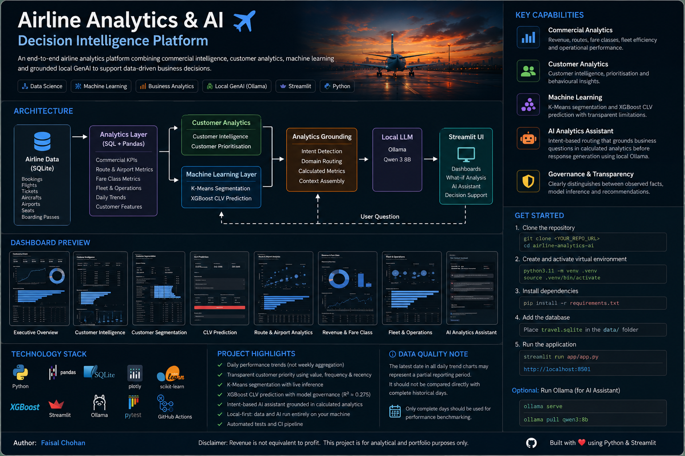
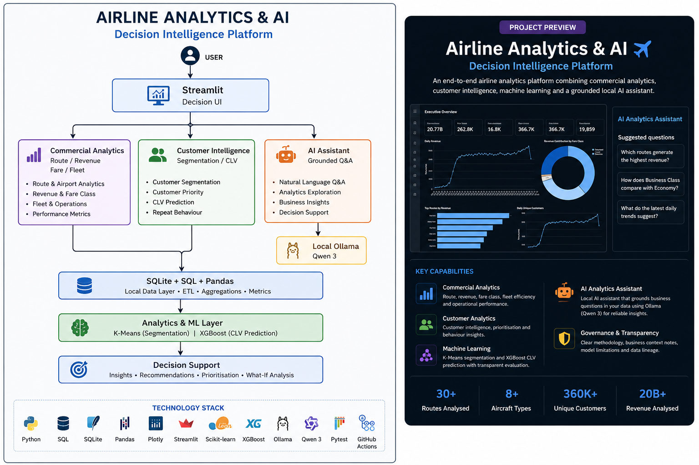

# Airline Analytics & AI Platform
**Airline Analytics & AI - Decision Intelligence Platform**

A portfolio-grade airline analytics platform combining commercial analytics, customer intelligence, machine learning, and grounded local Generative AI assistant in a Streamlit decision-support application.

---

## Project Overview

This project transforms airline operational and commercial data into management-facing insights across:

- Executive performance
- Customer intelligence
- Customer segmentation
- Customer Lifetime Value (CLV)
- Route and airport performance
- Revenue and fare-class analysis
- Fleet and operational performance
- Grounded local AI-assisted analytics

The platform demonstrates an end-to-end Data Science workflow:

**Data → SQL/Pandas Analytics → Business KPIs → Machine Learning → Grounded GenAI → Decision Support**

The objective is to demonstrate how analytical evidence can be translated into practical commercial and operational decisions.

---

## Key Findings

The analysis produced the following key business and customer insights:

- Identified four behavioural customer segments using K-Means clustering.
- Developed an XGBoost model to estimate customer lifetime value from observed customer behaviour.
- Identified differences in customer value, flight frequency, and recency across behavioural segments.
- Analysed route-level revenue, passenger volume, load factor, and revenue per flight to support route performance assessment.
- Compared revenue contribution, ticket-flight share, average fare, and fare-class mix across cabin classes.
- Evaluated fleet and aircraft performance using commercial and operational metrics.
- Built a grounded local GenAI assistant that uses calculated analytics to answer business questions without relying on external APIs.

---

## Project Preview



---

## Architecture



### Technical Architecture

```text
                         USER
                           |
                           v
                +---------------------+
                |      Streamlit      |
                |     Decision UI     |
                +----------+----------+
                           |
          +----------------+----------------+
          |                |                |
          v                v                v
   Commercial         Customer          AI Assistant
   Analytics          Intelligence      Grounded Q&A
   Route / Revenue    Segmentation /    Natural-language
   Fare / Fleet       CLV               analytics
          |                |                |
          |                |                v
          |                |          Local Ollama
          |                |             Qwen 3
          +----------------+----------------+
                           |
                           v
                 SQLite + SQL + Pandas
                           |
                           v
                  Analytics & ML Layer
                   K-Means | XGBoost
                           |
                           v
                    Decision Support
```

### Why Streamlit and Ollama run separately

The two services perform different jobs:

- **Streamlit** provides the dashboard and decision interface.
- **Ollama** provides local LLM inference through its local API.

The application therefore uses two terminal processes when the AI Assistant is enabled:

```text
Terminal 1
ollama serve

Terminal 2
streamlit run app/app.py
```

Ollama is optional. The core analytics and ML functionality remains available without it.

---

## Application Modules

| Module | Purpose |
|---|---|
| **Executive Overview** | Executive KPIs, revenue, customer activity, fare mix, and route performance |
| **Customer Intelligence** | Customer value, engagement, frequency, recency, and prioritisation |
| **Customer Segmentation** | K-Means behavioural segmentation and live segment inference |
| **CLV Prediction** | XGBoost customer-value what-if prediction |
| **Route & Airport Analytics** | Route revenue, load factor, revenue per flight, and airport movements |
| **Revenue & Fare Class** | Revenue share, ticket-flight share, average fare, and fare-class comparisons |
| **Fleet & Operations** | Aircraft commercial metrics, load factor, and flight-status analysis |
| **AI Analytics Assistant** | Local Ollama assistant grounded in calculated analytics |
| **Project & Methodology** | Architecture, modelling decisions, governance, and limitations |

---

## Key Business Questions

The platform is designed around questions relevant to airline commercial, customer, revenue, and operations teams:

- Which routes generate the most revenue?
- Which routes combine strong revenue with high load factor?
- Which airports have the greatest flight activity?
- How do Economy, Business, and Comfort compare in revenue contribution and ticket-flight share?
- Which aircraft models perform strongly on commercial-efficiency measures?
- Which customers have the highest historical value?
- How does flight frequency relate to customer value?
- Which behavioural customer segments emerge from the data?
- Which customers may require retention or re-engagement attention?
- Can customer lifetime value be estimated from observed behaviour?
- Can a local LLM explain calculated airline metrics without inventing figures?

---

## Analytical Design

### Executive and Daily Trends

The dashboard uses **daily aggregation** for its portfolio time-series views.

The dataset contains a relatively small number of observations for the displayed period, so weekly aggregation would compress the available signal. Daily aggregation preserves the underlying movement while the visualisation spaces date labels for readability.

The application therefore uses daily views for:

- Revenue
- Unique customers
- Average ticket-flight price

### Route Analytics

Route performance is analysed at route level.

Key measures include:

- Flights
- Tickets sold
- Passengers flown
- Revenue
- Average ticket price
- Load factor
- Revenue per flight

Revenue is deliberately **not presented as profit**, because operating-cost data is not available.

### Customer Intelligence

Customer analysis uses:

- Historical observed value
- Flight frequency
- Booking behaviour
- Recency
- Fare-class behaviour
- Cities visited
- Revenue per flight

Customer prioritisation considers **value, engagement, and recency**, rather than treating historical revenue alone as a complete definition of customer importance.

### Revenue and Fare Class

The application compares:

- Total revenue
- Revenue share
- Ticket-flight share
- Average ticket price
- Fare-class mix
- Average fare over time

Ticket-flight share and revenue share are treated as separate measures and are independently calculated.

### Fleet and Operations

Aircraft analysis includes:

- Total revenue
- Revenue per flight
- Revenue per available seat
- Load factor
- Flight frequency
- Flight-status mix

These are commercial-efficiency measures, not aircraft profitability measures.

---

## Machine Learning

### Customer Segmentation

K-Means clustering uses behavioural features including:

- Lifetime value
- Booking frequency
- Average transaction value
- Days since last booking

The numerical clusters are mapped to business-readable segment names:

1. **VIP Premium Customers**
2. **High-Value Customers**
3. **Low-Value Active Customers**
4. **At-Risk Customers**

These names are **business interpretations of unsupervised clusters**, not ground-truth labels.

The application provides live inference using the persisted K-Means model and scaler artefacts.

### Customer Lifetime Value

The modelling workflow evaluates:

- Linear Regression
- Random Forest
- XGBoost

The selected model is **XGBoost**.

| Metric | Result |
|---|---:|
| MAE | 28,071.87 |
| RMSE | 41,197.63 |
| R² | 0.275 |
| Training records | 293,386 |
| Testing records | 73,347 |

The model uses:

- Booking frequency
- Flight frequency
- Business-class flights
- Economy-class flights
- Comfort-class flights
- Cities visited
- Days since last booking

An R² of approximately **0.275** indicates modest explanatory power. The model is therefore presented as an **experimental portfolio baseline**, rather than a production-grade financial forecasting model.

---

## Grounded Local Generative AI Assistant

The AI Analytics Assistant uses targeted analytics context rather than sending the entire dataset to the LLM.

```text
User Question
      |
      v
Intent Detection
      |
      +---- Route
      +---- Customer
      +---- Fare
      +---- Fleet
      +---- Trend
      +---- Executive
      |
      v
Relevant Calculated Analytics
      |
      v
Ollama Local LLM
      |
      v
Concise Management Response
```

The assistant is designed to:

- Use calculated analytics as the source of truth.
- Avoid inventing dataset figures.
- Route questions to the relevant analytical domain.
- Distinguish revenue from profitability.
- Avoid unsupported causal claims.
- Separate observed facts from recommendations.
- Provide analytical evidence for responses where available.

This positions the LLM as a **grounded decision-support layer**, rather than an unrestricted chatbot.

---

## Data

The project uses a local SQLite airline database containing tables such as:

- `aircrafts_data`
- `airports_data`
- `boarding_passes`
- `bookings`
- `flights`
- `seats`
- `ticket_flights`
- `tickets`

The working SQLite database is intentionally excluded from version control.

Place it at:

```text
data/travel.sqlite
```

**Do not commit the database to GitHub.**

---

## Repository Structure

```text
Airline-Customer-Analytics/
│
├── .github/
│   └── workflows/
│
├── app/
│   ├── components/
│   ├── views/
│   ├── __init__.py
│   └── app.py
│
├── assets/
│
├── data/
│   └── README.md
│
├── docs/
│   ├── images/
│   │   ├── airline-analytics-architecture.png
│   │   └── airline-analytics-linkedin-overview.png
│   ├── ARCHITECTURE.md
│   ├── MODEL_CARD.md
│   └── RELEASE_NOTES.md
│
├── models/
│   ├── clv_feature_columns.pkl
│   ├── clv_prediction_model.pkl
│   ├── feature_columns.pkl
│   ├── kmeans_customer_segmentation.pkl
│   ├── kmeans_feature_columns.pkl
│   ├── kmeans_scaler.pkl
│   ├── model_metadata.pkl
│   ├── segment_names.pkl
│   └── xgboost_clv_model.pkl
│
├── notebooks/
│
├── src/
│
├── tests/
│
├── .env.example
├── .gitignore
├── pyproject.toml
├── README.md
├── requirements.txt
└── requirements-dev.txt
```

The notebook is retained as the analytical development record covering exploratory analysis, SQL analysis, customer segmentation, CLV modelling, and model development.

---

## Interface Design

The application uses a restrained dark executive interface designed for airline decision support.

- Dark charcoal background and neutral panels.
- Aviation blue as the primary analytical accent.
- Red reserved for risks, exceptions, and warnings.
- Green reserved for positive outcomes.
- Consistent KPI cards, Plotly charts, tables, and decision-signal callouts.
- Navigation grouped into Executive, Customer Intelligence, Commercial & Operations, and AI & Governance.

The interface intentionally avoids excessive decoration so analytical evidence remains the visual focus.

---

## How to Run

### Prerequisites

Recommended:

- Python 3.11
- Git
- Ollama for the optional AI Assistant

Python 3.11 is recommended for compatibility with the persisted machine-learning artefacts.

### 1. Clone the repository

```bash
git clone <YOUR_GITHUB_REPOSITORY_URL>
cd airline-analytics-ai
```

### 2. Create the virtual environment

#### macOS / Linux

```bash
python3.11 -m venv .venv
source .venv/bin/activate
```

#### Windows PowerShell

```powershell
python -m venv .venv
.venv\Scripts\Activate.ps1
```

Verify:

```bash
python --version
```

Expected:

```text
Python 3.11.x
```

### 3. Install dependencies

```bash
python -m pip install --upgrade pip
pip install -r requirements.txt
```

For development:

```bash
pip install -r requirements-dev.txt
```

### 4. Add the SQLite database

Place the database at:

```text
data/travel.sqlite
```

The database is intentionally excluded from GitHub.

### 5. Run tests

```bash
pytest
```

### 6. Start the Streamlit application

```bash
streamlit run app/app.py
```

Open:

```text
http://localhost:8501
```

---

## Optional Local AI Setup

The dashboard does not require Ollama unless you want to use the AI Analytics Assistant.

### Start Ollama

```bash
ollama serve
```

Keep that terminal running.

In a second terminal:

```bash
ollama list
```

If Qwen 3 8B is not installed:

```bash
ollama pull qwen3:8b
```

Then start the application:

```bash
source .venv/bin/activate
streamlit run app/app.py
```

The two processes are:

```text
Terminal 1
ollama serve

Terminal 2
source .venv/bin/activate
streamlit run app/app.py
```

You do not need to run `ollama run qwen3:8b` separately for the Streamlit application if the application connects directly to the Ollama API.

---

## Testing and Code Quality

Run the test suite:

```bash
pytest
```

The project uses Pytest for:

- Analytics calculations
- Database behaviour
- Machine-learning artefact loading
- Segmentation logic
- CLV prediction
- AI intent routing
- AI grounding behaviour

Run Ruff during development:

```bash
ruff check .
```

GitHub Actions is configured for automated checks on pushes and pull requests.

---

## Model Governance

This project intentionally distinguishes analytical evidence from model inference.

Important limitations:

- Revenue is not equivalent to profit.
- The CLV model has modest explanatory power.
- K-Means segment names are business interpretations of unsupervised clusters.
- Historical customer value is different from predicted future CLV.
- Customer priority bands are transparent analytical rules, not predictive labels.
- The local AI assistant is a decision-support layer, not an autonomous decision-maker.
- The SQLite dataset is not distributed with the repository.

Additional documentation is available in:

```text
docs/MODEL_CARD.md
docs/ARCHITECTURE.md
```

---

## Engineering Principles

- Separation of presentation, analytics, models, and AI services.
- Route-level aggregation for commercial analysis.
- Reproducible machine-learning environments.
- Joblib persistence for trained artefacts.
- Relative paths rather than machine-specific filesystem paths.
- Graceful degradation when Ollama is unavailable.
- Explicit model limitations and governance.
- Automated testing.
- Targeted AI grounding rather than unrestricted model responses.

---

## Technology Stack

| Layer | Technology |
|---|---|
| Language | Python |
| Data | Pandas, NumPy, SQLite |
| Analytics | SQL, Pandas |
| Visualisation | Plotly, Matplotlib |
| Machine Learning | Scikit-learn, XGBoost |
| Model Persistence | Joblib |
| Application | Streamlit |
| Local GenAI | Ollama |
| LLM | Qwen 3 8B |
| Testing | Pytest |
| Code Quality | Ruff |
| CI | GitHub Actions |
| Development | Jupyter, VS Code |

---

## Future Improvements

Potential next iterations include:

- Time-aware CLV validation.
- More advanced customer retention modelling.
- SHAP-based CLV explanations.
- Interactive route-network visualisation.
- Model monitoring and experiment tracking.
- Semantic retrieval for larger analytical contexts.
- Containerised deployment.
- Cloud deployment configuration.
- Automated data-quality monitoring.

---

## Author

**Faisal Chohan**

Data Scientist | Analytics | Machine Learning | Generative AI
