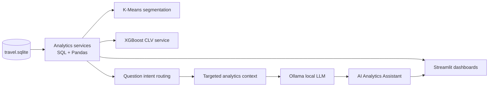

# Architecture

## System flow

## Design decisions

- **SQLite remains local:** the working database is about 168 MB and is excluded from Git.
- **UI and business logic are separated:** Streamlit views call reusable services under `src/`.
- **Route analytics are aggregated at route level:** aircraft-level rows are rolled up before route ranking so one route is not fragmented by aircraft type.
- **Grounded AI is targeted:** the assistant classifies each question and sends only the relevant calculated analytics domain to Ollama.
- **Revenue is not treated as profit:** the dataset does not contain operating costs.
- **Persisted models use Joblib:** this matches the export method used by the analytical notebook.
- **Model compatibility is explicit:** the repository pins the scikit-learn and XGBoost versions associated with the saved artefacts.
- **Graceful optional components:** Ollama is optional and cannot take down the analytical dashboards.

## Main layers

| Layer | Responsibility |
|---|---|
| `src/database.py` | Database connection and path handling |
| `src/analytics/` | KPI, customer, route, revenue and fleet queries |
| `src/models/` | CLV and segmentation inference services |
| `src/llm/` | Intent routing, analytics context construction and Ollama orchestration |
| `app/views/` | User-facing analytical workflows |
| `app/components/` | Shared dashboard styling, formatting and charts |
| `tests/` | Service-level validation |
